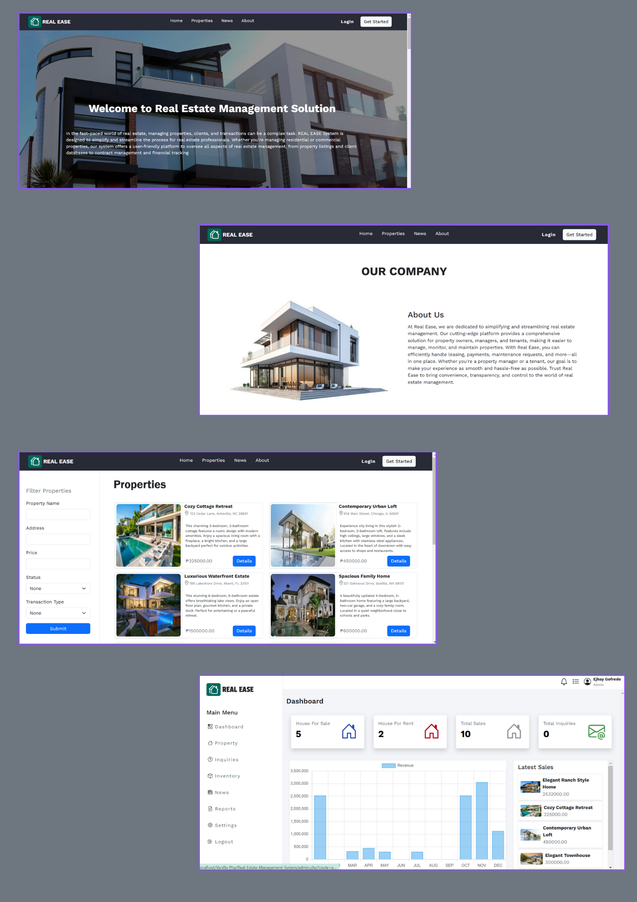

# REAL EASE - A Dynamic Real Estate Website
## Overview 📌
The real estate industry is a vital sector that involves the buying, selling, and management of properties across residential, commercial, and industrial markets. It offers significant investment opportunities and plays a key role in economic growth and community development. With evolving market demands, real estate continues to provide diverse opportunities for growth, investment, and innovation.

## Features
 - Home Page
    - Introduction Section(Brief overview of the platform)
    - Benefit Section(Highlights the advantages of using the platform.)
    - Latest Properties(Showcases the most recent property listings)
    - Expert Section(Features industry experts offering advice or services.)
 - Propeties Page
    - Filter(Search and filter properties based on various criteria (e.g., location, price, type).)
    - View Details(Detailed view of individual property listings.)
    - Inquire(Option to inquire or contact about a specific property.
)
 - News Page
    - News Lists
 - About Page
    - About Us Information
 - Admin
    - Dashboard
        - total house sale
        - total house rent
        - total number house sales
        - total inquiries
        - Latest Sales
        - Revenue Graph
    - Property
        - CRUD
    - Inquiries
        - View
    - Inventory
        - CRUD
    - News
        - CRUD
 - Login/Logout

 ## Tech Stack
 - Frontend: HTML, CSS, Bootstrap
 - Backend: PHP
 - Database: MySQL